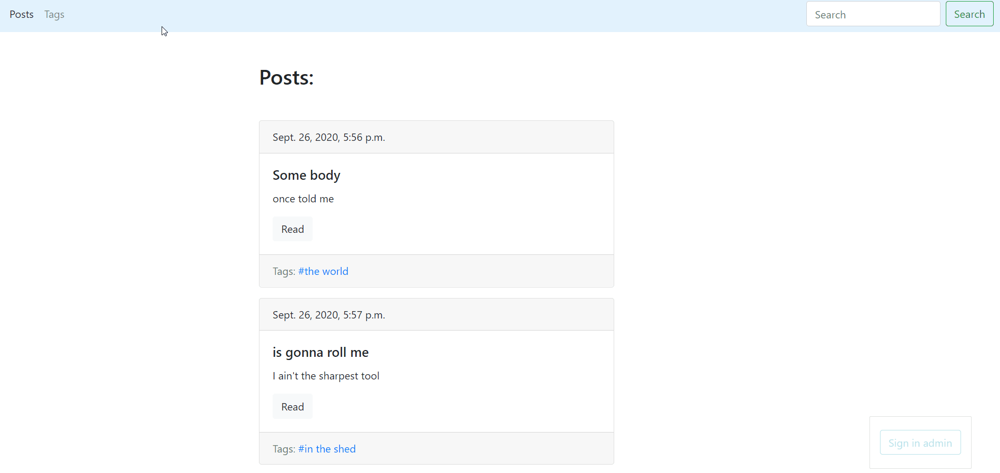

## Description
Simple blog based on `django` with using `bootstrap`

## Installation

Use the package manager [pip](https://pip.pypa.io/en/stable/) to install django.

```
pip install django
```
Or use 
```
pip install -r requirements.txt
```

## Usage
Enter the command in the terminal in the project folder
```
python manage.py runserver
```

## License
[MIT](https://choosealicense.com/licenses/mit/)
